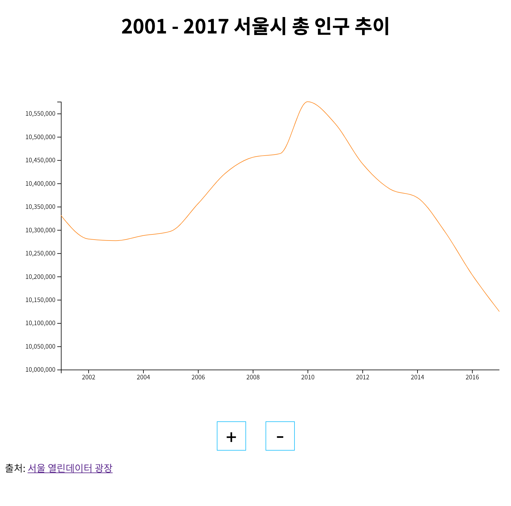
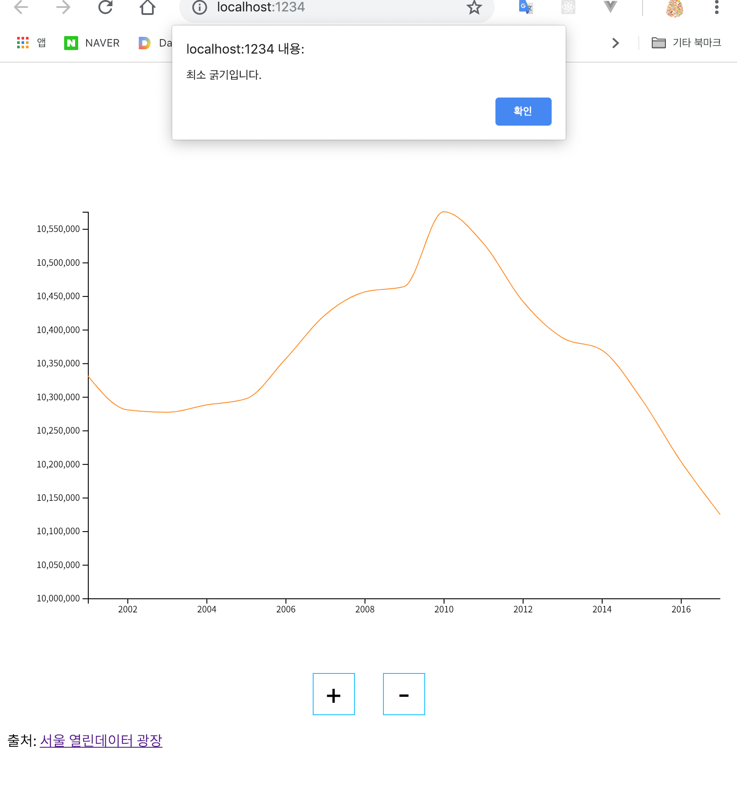
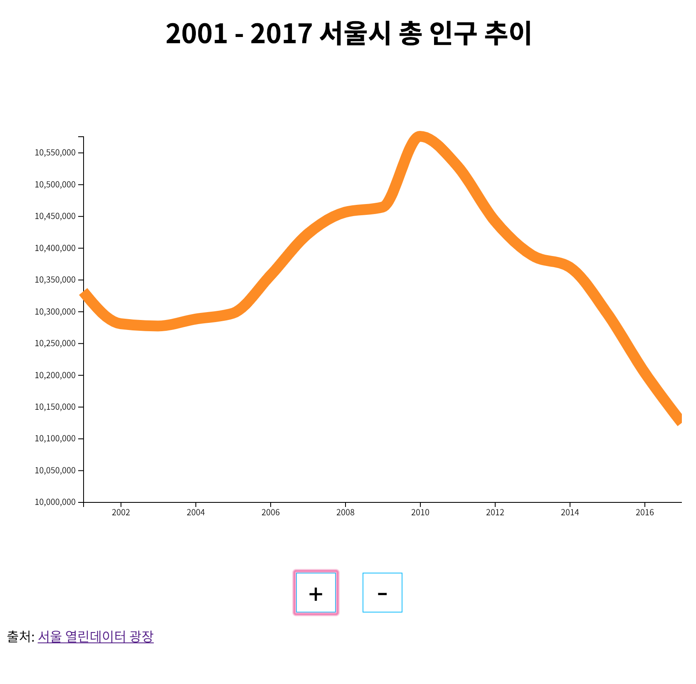

# Chart Control App

## 개요

주어진 데이터로 웹브라우저 위에 차트를 그리고 그래프의 굵기를 조절할 수 있는 어플리케이션입니다. Node 환경에서 데이터 시각화 패키지인 d3.js를 이용해 차트를 구현했습니다. 번들러는 Webpack보다 가벼운 Parcel을 사용했습니다.

## d3.js

d3.js는 데이터를 시각화하는 모든 방식이 집대성된 패키지입니다. 이것도 pandas와 마찬가지로 csv, xml 파일을 읽어들여 데이터셋을 구성할 수 있었습니다. 다만 x축, y축에 그래프까지 따로 그려야 해서 이런 단순한 차트에 사용하기엔 다소 번거로워 보이기도 했습니다.


## 기술 스펙

- d3.js
- Parcel

## 파일 구조

```
.
├ index.js
├ index.html
└ index.css
```

## 설치 및 실행

소스코드 디렉터리로 들어가서 npm 의존성 패키지를 설치합니다.

```
$ cd chart

# npm
$ npm install

# yarn
$ yarn
```

그리고 Node 서버를 실행합니다.

```
# npm
$ npm run start

# yarn
$ yarn start
```

서버가 작동하기 시작하면 `localhost:1234`로 접속하면 됩니다.

## 사용법



사용법은 단순합니다. '+' 버튼을 누르면 그래프의 두께가 굵어지고 '-' 버튼을 누르면 가늘어집니다. 더 이상 가늘어질 수 없게 되면 경고 메시지가 뜹니다.



('최소 굵기입니다' 경고)



(두꺼워졌을 때의 모습)
